<p align="center">
  
</p>

<p align="center">
  
  
  
  
  
</p>

<p align="center">
  <a href="#tentang-proyek">Tentang</a> &nbsp;|&nbsp;
  <a href="#cara-instalasi">Instalasi</a> &nbsp;|&nbsp;
  <a href="#cara-menjalankan-aplikasi">Menjalankan</a> &nbsp;|&nbsp;
  <a href="#daftar-fitur-yang-berhasil-diimplementasikan">Fitur</a> &nbsp;|&nbsp;
  <a href="#anggota-kelompok">Tim</a>
</p>


## Tentang Proyek

**SIMOBILE** adalah prototipe aplikasi kasir mobile untuk usaha kelontong **Toko Makmur Jaya** milik Bu Marni. Aplikasi ini membantu mencatat produk, keranjang, dan transaksi penjualan langsung dari HP, **tanpa server dan tanpa koneksi internet**. Seluruh data disimpan di dalam aplikasi (in-memory), sesuai ketentuan UTS.

Dibuat untuk **UTS Hybrid Mobile Programming (Gasal 2026/27)** menggunakan **Ionic Angular**.

<p align="center">
  
</p>

| Teknologi | Keterangan |
|---|---|
| Ionic 9 | Komponen UI mobile |
| Angular 22 | Framework (berbasis NgModule, tanpa `zone.js`) |
| TypeScript dan SCSS | Bahasa pemrograman dan styling |


## Cara Instalasi

### Prasyarat

- **Node.js 22.22.3 atau lebih baru.** Angular CLI 22 menolak versi di bawahnya. Versi 24.15.0 atau 26.0.0 ke atas juga bisa.
- **npm** (sudah terpasang bersama Node.js)
- **Git**
- **Ionic CLI.** Jika belum terpasang:

  ```bash
  npm install -g @ionic/cli
  ```

### Langkah-langkah

**1. Clone repository**

```bash
git clone https://github.com/valennxero/simobile.git
```

**2. Masuk ke folder aplikasi.** Di dalam repository ada folder `simobile` yang berisi proyek Ionic:

```bash
cd simobile/simobile
```

**3. Pasang dependensi** (cukup sekali, saat pertama kali):

```bash
npm install
```

> [!IMPORTANT]
> Jalankan `npm install` di folder `simobile/simobile`, yaitu folder yang berisi `angular.json`, bukan di root repository.


## Cara Menjalankan Aplikasi

**1.** Pastikan terminal berada di folder `simobile/simobile`.

**2.** Jalankan:

```bash
ionic serve
```

**3.** Buka alamat yang tampil di terminal, biasanya **http://localhost:8100**.

**4.** Agar tampilannya seperti di HP, buka DevTools browser (tekan `F12`) lalu aktifkan mode perangkat (device toolbar).

> [!NOTE]
> Data produk, keranjang, dan riwayat transaksi disimpan di memori aplikasi. Jika halaman di-refresh, atau `ionic serve` memuat ulang karena ada perubahan kode, data kembali ke kondisi awal (12 produk dummy). Ini sesuai ketentuan UTS, karena penyimpanan permanen dikerjakan pada UAS.

<details>
<summary><b>Kendala yang sering muncul</b></summary>

<br>

| Masalah | Solusi |
|---|---|
| `The Angular CLI requires a minimum Node.js version...` | Versi Node terlalu lama. Perbarui Node.js, lalu cek dengan `node -v`. |
| `ionic: command not found` | Ionic CLI belum terpasang. Jalankan `npm install -g @ionic/cli`. |
| Port 8100 sedang dipakai | Jalankan di port lain: `ionic serve --port=8101`. |
| Error saat `npm install` | Pastikan perintah dijalankan di folder `simobile/simobile`, bukan di root repository. |

</details>


## Daftar Fitur yang Berhasil Diimplementasikan

| No | Fitur | Yang bisa dilakukan | Status |
|:-:|---|---|:-:|
| 1 | **Struktur navigasi** | 4 tab (Dashboard, Produk, Transaksi, Profil) dan side menu berisi Pengaturan, Tentang Aplikasi, Logout | ✅ |
| 2 | **Dashboard** | Jumlah produk, transaksi hari ini, omzet hari ini, produk terlaris | ✅ |
| 3 | **Pencarian real-time** | Daftar produk terfilter langsung saat mengetik, tanpa tombol submit | ✅ |
| 4 | **Detail produk** | Halaman detail via ID di URL: stok, harga beli, harga jual, estimasi untung | ✅ |
| 5 | **Property dan event binding** | Gambar default, tombol keranjang disabled saat stok 0, aksi klik via event | ✅ |
| 6 | **Form tambah dan edit produk** | Reactive Form dengan validasi dan pesan error per field | ✅ |
| 7 | **Angular Service** | 4 service: Product, Cart, Transaction, Theme | ✅ |
| 8 | **Custom theme dan dark mode** | Palet hijau-kuning dan toggle mode gelap/terang | ✅ |
| 9 | **Animasi** | Swipe-to-delete pada item keranjang | ✅ |
| 10 | **Keranjang dan checkout** | Atur jumlah, total otomatis, konfirmasi transaksi | ✅ |
| 11 | **Riwayat transaksi** | Daftar transaksi dan halaman detail tiap transaksi | ✅ |

### Rincian per fitur

<details>
<summary><b>1. Navigasi</b></summary>

<br>

- Navigasi utama berbentuk **4 tab**: Dashboard, Produk, Transaksi, dan Profil.
- **Side menu (drawer)** berisi Dashboard, Pengaturan, Tentang Aplikasi, dan Logout.
- Logout menampilkan dialog konfirmasi. Logout bersifat simulasi dan mengembalikan pengguna ke Dashboard, karena belum ada autentikasi pada UTS ini.

</details>

<details>
<summary><b>2. Dashboard</b></summary>

<br>

Ringkasan hari ini yang dihitung oleh service dan ditampilkan dengan **interpolation binding**:

- Jumlah produk
- Total transaksi hari ini
- Omzet hari ini
- Produk terlaris hari ini

</details>

<details>
<summary><b>3 dan 4. Pencarian dan detail produk</b></summary>

<br>

- Daftar produk langsung terfilter berdasarkan nama saat pengguna mengetik (**two-way binding dengan `ngModel`**). Jika tidak ada hasil, tampil pesan produk tidak ditemukan.
- Klik produk membuka detail berdasarkan ID di URL (`/tabs/produk/detail/:id`): stok sisa, harga beli, harga jual, dan estimasi untung per item.

</details>

<details>
<summary><b>5. Property dan event binding</b></summary>

<br>

- Produk tanpa gambar menampilkan **gambar default** (`[src]`).
- Tombol tambah ke keranjang otomatis **disabled** saat stok 0 (`[disabled]`).
- Aksi klik tombol ditangani dengan **event binding** (`(click)`).
- Ikon keranjang menampilkan badge jumlah item.

</details>

<details>
<summary><b>6. Form tambah dan edit produk</b></summary>

<br>

Menggunakan **Reactive Form** (`FormBuilder`, `FormGroup`, `Validators`).

| Field | Aturan validasi |
|---|---|
| Nama produk | Wajib diisi |
| Kategori | Wajib diisi |
| Harga beli dan harga jual | Wajib diisi, harus berupa angka lebih dari 0 |
| Stok | Wajib diisi, tidak boleh negatif |
| URL gambar | Opsional |

- Pesan error tampil di setiap field yang salah, dan isian yang sudah benar tidak hilang.
- Mode edit mengisi form otomatis dari data produk (`/tabs/produk/form/:id`).

</details>

<details>
<summary><b>7. Angular Service</b></summary>

<br>

Logic data dipisahkan dari komponen ke 4 service:

| Service | Tugas |
|---|---|
| `ProductService` | Data produk, pencarian, tambah, ubah, pengurangan stok |
| `CartService` | Isi keranjang, jumlah item, total belanja |
| `TransactionService` | Checkout, riwayat transaksi, ringkasan harian |
| `ThemeService` | Pengaturan mode gelap/terang |

</details>

<details>
<summary><b>8 dan 9. Tema, dark mode, dan animasi</b></summary>

<br>

- Palet warna **hijau-kuning** sesuai identitas toko (`src/theme/variables.scss`).
- **Toggle mode gelap/terang** di halaman Pengaturan.
- **Swipe-to-delete** pada item keranjang menggunakan `ion-item-sliding`.

</details>

<details>
<summary><b>10 dan 11. Keranjang, checkout, dan riwayat</b></summary>

<br>

- Ubah jumlah item dengan tombol tambah dan kurang, atau geser item untuk menghapus.
- Total belanja dihitung otomatis.
- Tombol **Konfirmasi Transaksi** menyimpan transaksi ke riwayat, mengurangi stok produk, dan mengosongkan keranjang.
- Riwayat menampilkan semua transaksi, dan tiap transaksi bisa diklik untuk melihat detail lengkap (`/tabs/transaksi/detail/:id`).

</details>

### Fitur pendukung

- **12 data dummy produk** dengan variasi harga, stok (termasuk stok 0), dan kategori.
- Halaman **Profil** (pemilik dan nama toko), **Pengaturan**, dan **Tentang Aplikasi**.


## Struktur Folder Utama

```
simobile/                          <- root repository
├── docs/                          <- gambar animasi untuk README
└── simobile/                      <- proyek Ionic (jalankan perintah di sini)
    └── src/
        ├── app/
        │   ├── models/            <- Product, CartItem, Transaction
        │   ├── services/          <- product, cart, transaction, theme
        │   ├── tabs/              <- dashboard, produk, keranjang, transaksi, profil
        │   ├── pengaturan/        <- halaman pengaturan (toggle mode gelap)
        │   └── tentang/           <- halaman tentang aplikasi
        └── theme/variables.scss   <- palet warna dan dark mode
```


## Anggota Kelompok

**Kelompok The Dark Side of The Moon**

| Nama | NRP |
|---|---|
| Jevon Valentino | 160424066 |
| Valens Oliver | 160424091 |
| Nicholas Davian | 160424070 |
| Matthew Lenky | 160424055 |

<p align="center">
  <sub>Dibuat dengan Ionic Angular untuk UTS Hybrid Mobile Programming, Gasal 2026/27</sub>
</p>